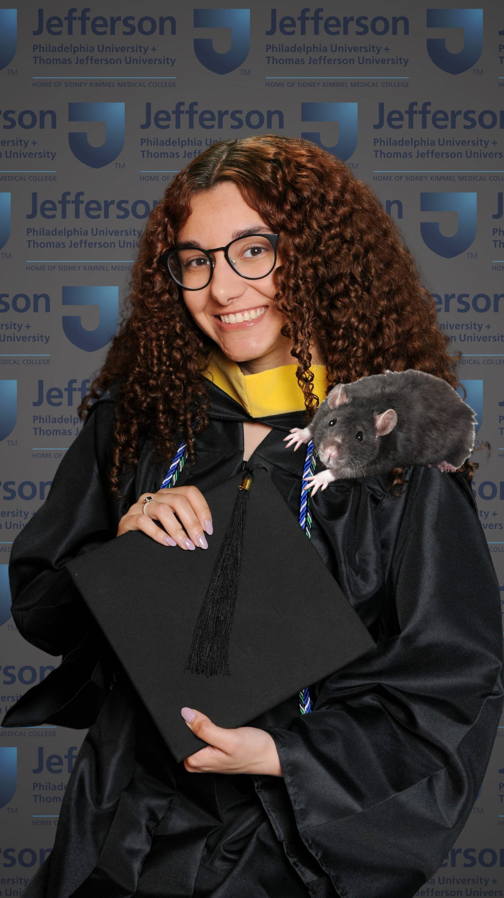
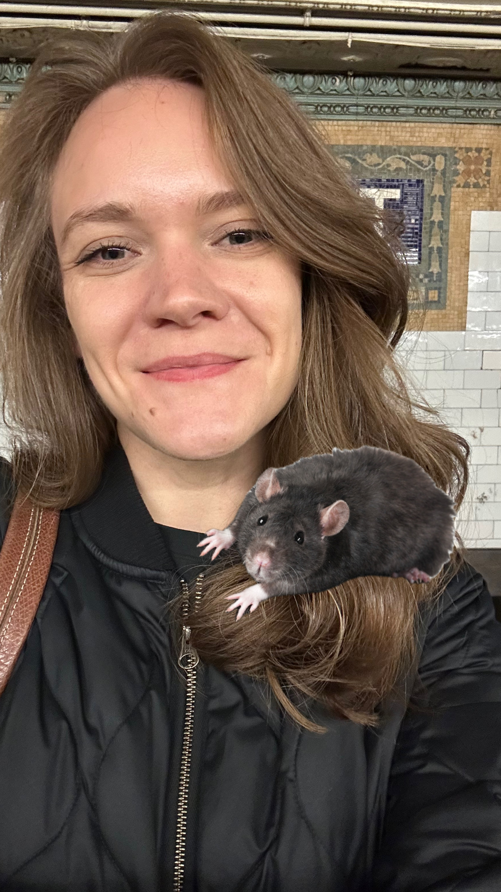

```{r setup, include=FALSE}
knitr::opts_chunk$set(echo = TRUE)

library(magick)
library(cropcircles)
```


#  Wynter Henry

**About Wynter:**

Wynter is a first year MS in Epidemiology candidate here at Mailman. She has a BS in Biology and a minor in Public Health Analytics from Thomas Jefferson University in Philadelphia, PA. Wynter is interested in infectious disease epidemiology and wants to help prevent the next pandemic. She hopes to continue her studies in epidemiology and public health by pursing a PhD. 

-----------------------------------------------------

#  Laylah Jones

**About Laylah:**

Laylah is a first year MS student in Epidemiology at the Mailman School of Public Health. She received her BS in Psychology from Drexel University in Philadelphia, PA and worked as a Project Coordinator at a Neuropsychology research lab focusing on individuals with neurodevelopmental disorders and brain development. Laylah is interested in pursuing Psychiatric Epidemiology in hopes of addressing mental health disparities in underrepresented populations and minority communities.

-----------------------------------------------------

#  Quinn Anderson

**About Quinn:**

Quinn is a first year MS in Epidemiology candidate at the Mailman School of Public Health. She received her BS in Public Health from American University in Washington, DC. Previously, she conducted research regarding sexual minority adolescent (SMA) behavioral health outcomes related to familial support. Most recently, she worked at the Yale Center for Outcomes and Research Evaluation coordinating health outcomes research. Her research interests are chronic disease epidemiology and psychiatric epidemiology. 


