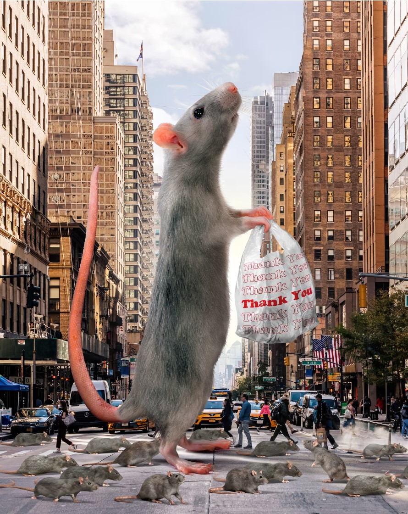

“The rats are absolutely going to hate this announcement. But the rats don’t run this city, we do.”

- Jessica Tisch, New York City’s sanitation commissioner



## Rat Sightings and Trash Collection

```{r setup, include=FALSE}
knitr::opts_chunk$set(echo = TRUE)
library(leaflet)
library(tidyverse)
library(readr)
library(dplyr)
library(ggplot2)
library(scales)
library(ggthemes)
library(shiny)
knitr::opts_chunk$set(
	echo = TRUE,
	warning = FALSE,
	message = FALSE, 
	fig.width = 8, 
  fig.height = 6,
  out.width = "90%"
)
theme_set(theme_minimal() + theme(legend.position = "bottom"))
options(
  ggplot2.continuous.colour = "viridis",
  ggplot2.continuous.fill = "viridis"
)

scale_colour_discrete = scale_colour_viridis_d
scale_fill_discrete = scale_fill_viridis_d

theme_set(theme_minimal() + theme(legend.position = "bottom"))
```

```{r datasets setup, include=FALSE}
dsny_df <- read_csv("data/DSNY_Monthly_Tonnage_Data_20231108.csv") 

dsny_df = 
  dsny_df |> 
  janitor::clean_names() |> 
  separate(month, c("year", "month"), sep = " / ") |> 
  filter(year == "2023") |> 
  select(-communitydistrict, -resorganicstons, -schoolorganictons, -leavesorganictons, -xmastreetons)


rodent_inspec_df <- read_csv("data/Rodent Inspection Data - 2023.csv")

rodent_inspec_df = 
  rodent_inspec_df |> 
  janitor::clean_names() |> 
  select(-job_id, -job_ticket_or_work_order_id, -job_progress, -bbl, -house_number, -street_name, -block, -lot, -approved_date, -location, -community_board, -council_district, -census_tract, -bin, -nta)

rodent_tidy = 
  rodent_inspec_df |>
  mutate(inspection_date = parse_date_time(inspection_date, orders = "mdy HM"),
         day = day(inspection_date), 
         month = sprintf("%02d", month(inspection_date)), 
         year = year(inspection_date),  
         hour = hour(inspection_date),  
         minute = minute(inspection_date)) |> 
  select(-day, -hour, -minute, -boro_code)
  

total_rat_df = merge(dsny_df, rodent_inspec_df)

rat_merge_df = merge(dsny_df, rodent_tidy)
```

```{r}
rat_merge_2 = 
  rat_merge_df |>
  ggplot(aes(longitude, latitude)) +
  geom_point() +
  theme_map()

rat_map = 
  leaflet(data = rat_merge_df) |> 
  addTiles() |> 
  addMarkers(
    lng = ~longitude,
    lat = ~latitude,
    clusterOptions = markerClusterOptions())

rat_map
```


